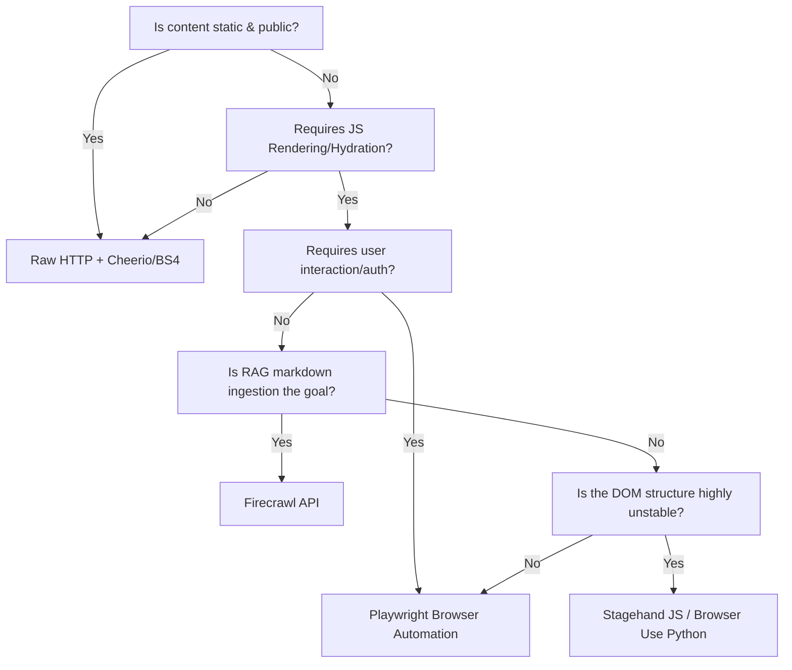
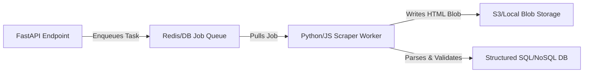

# Web Scraping, Crawling & Browser Automation (data-scraping)

This skill defines the technical standards, architectural patterns, decision frameworks, and failure-mode mitigations for web data acquisition across workspace projects.

---

## 1. Workspace Scraping Doctrine

All scraping tasks in the workspace must adhere to three core pillars:
1. **Frugality (Stateless-First)**: Never spawn a heavy browser instance (Playwright/Puppeteer) if a raw HTTP request (Requests/Axios) can fetch the source. Browser automation is a last resort.
2. **Deterministic Schemas**: Scraped data must always be validated against a strict schema (Pydantic in Python, Zod in TypeScript) before passing to downstream logic.
3. **Resilience & Self-Healing**: Expect websites to fail, block requests, or modify their DOM. Design scraping pipelines with explicit timeouts, exponential backoffs, and fallback pathways.

---

## 2. Scraping Decision Matrix

Use this checklist to select the scraping architecture:



### Stack Selection Guidelines

*   **Stateless HTTP (Default)**: Use when scraping public RSS feeds, SEO headers, or static blogs.
*   **Playwright (Workspace Standard Browser)**: Use when scraping client-rendered SPAs, behind authentication, or requiring pagination scrolling.
*   **Crawlee**: Use when scraping large-scale websites (1000+ pages) requiring managed queues and concurrency.
*   **Firecrawl**: Use when feeding unstructured websites into RAG systems or LLM context blocks.
*   **Stagehand / Browser Use**: Use only for testing highly unstable third-party interfaces where CSS selectors drift continuously.

---

## 3. Core Architectural Patterns

### A. Inline Synchronous Extraction (FastAPI / Express API Defaults)
When a client requests immediate data from a website, structure the extraction inline but protect the request budget with strict timeouts and error fallbacks.

```python
# Reference implementation skeleton for backend controllers
from fastapi import HTTPException
import asyncio
from pydantic import BaseModel, HttpUrl

class ScrapePayload(BaseModel):
    url: HttpUrl

class ExtractedData(BaseModel):
    title: str
    body_text: str
    metadata: dict

async def run_inline_extraction(payload: ScrapePayload) -> ExtractedData:
    # 1. Enforce a hard global timeout budget (e.g., 30s)
    try:
        async with asyncio.timeout(30.0):
            # Execute scraping driver (HTTP or Playwright)
            data = await perform_extraction(payload.url)
            return ExtractedData(**data)
    except TimeoutError:
        # 2. Return fallback cache or structured error
        raise HTTPException(status_code=504, detail="Scraping operation timed out")
```

### B. Decoupled Queue-Worker Pattern (High-Scale Crawls)
For deep crawls or multi-page scraping, decouple the scraper from the API request lifecycle. Use a worker queue (e.g., Celery, BullMQ, or n8n async webhooks) and persist raw payloads before parsing.


*Doctrine: Always separate target page fetching from parsing. If your parser fails due to a DOM change, you should be able to re-run the parser over the persisted HTML blob without re-fetching the target site and risking an IP ban.*

---

## 4. Workspace Defaults & Hardening Rules

When implementing Playwright or raw HTTP clients, apply these default configurations to avoid simple bot protections.

### Playwright Launch Defaults
*   **Automation controlled override**: Disable Chrome's webdriver flags.
*   **Default timeouts**: Always set navigation and selector timeouts (default to `15000`ms, never leave infinite).
*   **Stealth execution settings**:

```python
# Python Playwright Workspace Configuration
launch_options = {
    "headless": True,
    "args": [
        "--disable-blink-features=AutomationControlled",
        "--no-sandbox",
        "--disable-setuid-sandbox"
    ]
}

context_options = {
    "user_agent": "Mozilla/5.0 (Windows NT 10.0; Win64; x64) AppleWebKit/537.36 (KHTML, like Gecko) Chrome/120.0.0.0 Safari/537.36",
    "viewport": {"width": 1280, "height": 720},
    "accept_downloads": False
}
```

### HTTP Client Hardening
*   **User-Agent Whitelist**: Never send default request headers (`python-requests`, `axios/1.x`). Use a modern Chrome header array.
*   **Connection Pooling**: Re-use sessions (`requests.Session()`) to keep sockets alive and bypass connection handshake flags.

---

## 5. Failure Modes & Resiliency Tactics

Every scraper *will* fail. Implement these standard recovery paths:

### A. IP Rate Limiting & Captchas (403 / 429 Status)
*   **Symptom**: Target site returns HTTP 429, 403, or prompts a Cloudflare/DataDome challenge.
*   **Tactic 1 (Backoff)**: Apply exponential backoff with random jitter.
*   **Tactic 2 (Stealth Proxy)**: Rotate outbound proxies (Commercial or Residential, depending on target security).
*   **Tactic 3 (DDG Search Fallback)**: If a single article or post is blocked, query DuckDuckGo (HTML parser format) for syndicated copies on unprotected third-party domains.

### B. Selector Drift & DOM Shift (Empty Selector Results)
*   **Symptom**: Parser returns empty lists or missing fields after a website UI update.
*   **Tactic 1 (Semantic Tags)**: Target HTML5 semantic structure (`article`, `main`, `header`) and ARIA roles (`role="main"`) rather than fragile nested Tailwind CSS class paths (e.g. `div.flex.items-center.justify-between`).
*   **Tactic 2 (LLM Extraction Recovery)**: If structured regex/selectors fail, fallback to a local LLM or API call with the raw page text to extract elements dynamically.

### C. Resource Leakage (Memory spikes / Zombie Browsers)
*   **Symptom**: Server out of memory due to orphaned headless browser processes.
*   **Tactic 1 (Strict Context Scope)**: Always wrap browser instances in context managers (`async with` in Python, `try/finally` in Node.js) to guarantee process teardown on failure.
*   **Tactic 2 (Process Harvester)**: In deployment environments, execute a daily cron or monitoring hook to sweep and terminate orphaned Chrome/Chromium processes (`pkill -f chrome`).

---

## 6. Verification and Visual Audit Guidelines

1. **Syntax Integrity**: Run `python -m py_compile` or `tsc --noEmit` on all parser components to guarantee import/type safety.
2. **Deterministic Testing**: Write unit tests using mocked HTML pages (fixtures) to verify parser logic independent of remote network state.
3. **Execution Sandboxing**: All scrapers must be tested inside target repositories. Diagnostic screenshots, DOM dumps, and logs must be confined to the project's temporary/ignored output folders.
