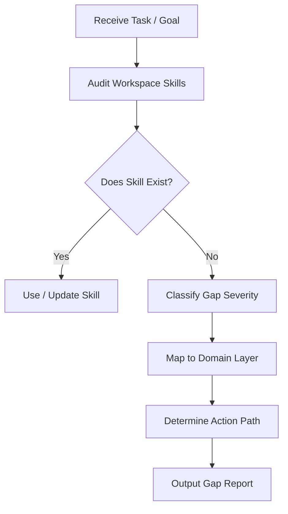

# Knowledge Gap Analysis

## Overview
This skill governs how coding agents audit current workspace knowledge against required project goals, classify deficiencies, and determine the optimal path for remediation (whether using existing tools, modifying current assets, or discovering external implementations).

---

## Workflow



### Step 1: Capability Auditing
Compare the user's objective or target project requirements against the skills registered under `.agents/skills/` (and indexed in the `/skills/README.md` Capability Hierarchy).

### Step 2: Gap Severity Classification
Analyze the impact of the missing capability on completing the immediate task:
*   **Blocker**: The task cannot be executed or verified without this capability (e.g., trying to write end-to-end tests without browser automation drivers).
*   **Major**: The task can be done with manual overrides, but lacks safety, quality checks, or templates, raising risk (e.g., implementing custom OAuth without an established secure Auth skill).
*   **Minor**: An optimization or secondary checklist is missing, but the core work is unblocked.
*   **Optional**: A nice-to-have visual standard or alternative developer setup is absent.

### Step 3: Domain Mapping
Categorize the identified gap into one of the canonical workspace domains:
*   `backend`: APIs, databases, authentication, servers.
*   `frontend`: Layouts, visual design, client frameworks, UI state.
*   `infra`: Docker, CI/CD, hosting, VPS provisioning.
*   `data`: Scraping, pipeline tooling, processing.
*   `engineering`: Debugging, testing, PR review standards.
*   `product`: User journeys, specs, product specs.
*   `meta`: Self-improvement, repository discovery, imports.

### Step 4: Remediation Determination
Select the most appropriate path to resolve the gap:
1.  **Use Existing Skill**: If a current skill covers the requirement (avoid duplicate files).
2.  **Update Existing Skill**: If the current skill exists but lacks details (e.g., adding FastAPI guidelines to `backend.md`).
3.  **Create New Skill**: If the skill is unique and absent (e.g., creating a new domain skill).
4.  **Search External Repositories**: If the missing capability is complex, search external plugins/cache first before writing from scratch.

---

## Output Report Format

When a gap is identified, output a report using the following structure:

```markdown
### Knowledge Gap Analysis Report

- **Current Capability**: [Describe existing workspace tools/skills related to the request]
- **Required Capability**: [Specify the precise tech/workflow required by the user]
- **Gap**: [Identify what specifically is missing]
- **Domain**: [backend | frontend | infra | data | engineering | product | meta]
- **Severity**: [Blocker | Major | Minor | Optional]
- **Recommended Remediation Path**: [Use Existing | Update Existing | Create New | Search External]
- **Recommended Next Step**: [Actionable next action, e.g., run `github-repo-discovery`]
```
