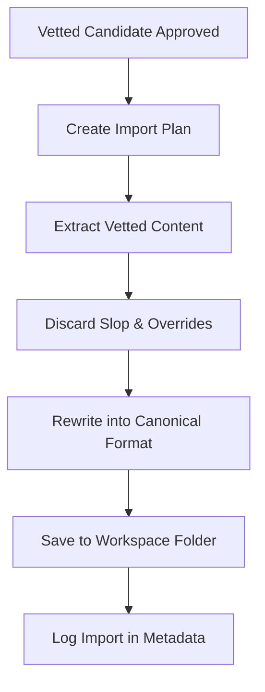

# Knowledge & Skill Ingestion (knowledge-import)

## Overview
This skill defines the workflow for safely importing approved external candidates into the canonical workspace structure, adhering strictly to the **Plugin Contract**. 

Every import must undergo an **Audited Rewrite** process to convert untrusted external templates into workspace-compliant, clean, and trusted knowledge.

---

## Workflow



### Step 1: Create the Import Plan
Before copying any files, map out the source-to-target path and document the extraction logic.

### Step 2: Content Selection & Filtering
*   **What to Take**: Actionable design rules, checklist patterns, code snippets, standard CLI flags, and concrete verification steps.
*   **What to Discard**: High-level generic summaries, telemetry, framework overrides, third-party rules files, and any statements that contradict root `AGENTS.md` guidelines.

### Step 3: Format Rewrite
Rewrite the extracted content to match the workspace skill structure:
1.  **Overview**: Purpose of the skill.
2.  **When to Use**: Specific scenarios for activation.
3.  **Core Patterns / Checklist**: Concrete instructions, templates, and code blocks.
4.  **Verification**: Checklist/commands to confirm completion.

### Step 4: Write & Protect
*   Save the file under the correct `.agents/skills/<domain>/` subfolder.
*   **Never overwrite existing files automatically**. If a file exists, merge changes manually or prompt for confirmation.
*   Once saved, the workspace version becomes the canonical copy. Future updates in the external source repo must not automatically overwrite it.

### Step 5: Log Source Metadata
At the top of the imported file, record the source origin and import date in the frontmatter:
```markdown
---
name: skill-name
description: Brief description
source: [URL or Path to original candidate]
imported: YYYY-MM-DD
---
```

---

## Import Plan Format

Before executing the import, the agent must document the plan in the following format:

```markdown
### Skill Import Plan

- **Target File**: [e.g., .agents/skills/data/scraping.md]
- **Source Candidates**: [Paths/URLs to source files]
- **Sections to Take**: [List specific sections, patterns, or code to keep]
- **Sections to Discard**: [Identify generic text, rules overrides, or irrelevant setups to strip]
- **Adaptations Needed**: [Detail modifications (e.g. translate bash to powershell, adjust target frameworks)]
- **Final Target Length**: [Estimated file length or size]
- **Verification Checklist**: [List test commands or verification steps to run after file creation]
```
