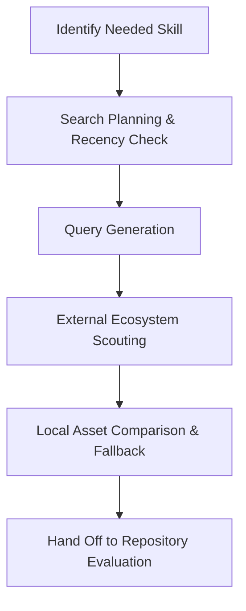

# GitHub Repo & External Capability Discovery

## Discovery Philosophy

The purpose of discovery is **not**:
* To find what we already have in local caches.

The purpose of discovery is **to**:
* Find the best, most robust, and highest-quality available knowledge today.

By prioritizing external ecosystem scouting over local knowledge, we prevent local-knowledge bias and ensure the workspace continually adopts state-of-the-art patterns.

---

## Workflow



### Step 1: Search Planning & Recency Check
Before starting a search, formulate a clear search plan:
1.  **Define Objective**: What specific capability or technical pattern is required? (e.g., "Web scraping with headers, retries, and proxy rotation in Python").
2.  **Determine Tech Stack Constraints**: Does the solution need to fit a specific framework or language? (e.g., Python/FastAPI, Node.js/TypeScript).
3.  **Check Recency Rule**: External discovery is **mandatory** for high-velocity domains including:
    *   AI tooling & frameworks
    *   Agent systems & orchestration engines
    *   Web scraping & browser automation
    *   Developer tooling & CLI libraries
    *   Deployment workflows & CI/CD
    *   Infrastructure & VPS provisioning
4.  **Scope Resources**: Allocate search limits (e.g., "Find 3-5 candidates for comparison").

### Step 2: Query Generation
Construct precise search strings using search engine/GitHub qualifiers to filter out noise and target high-density repositories:
*   **Topic/Keyword Queries**: Use specific tech combinations (`"fastapi" "oauth2" "redis"`).
*   **GitHub Qualifiers**:
    *   `language:<lang>` (e.g., `language:python`, `language:typescript`)
    *   `topic:<topic>` (e.g., `topic:web-scraping`, `topic:crawler`)
    *   `stars:>=100` (filters out empty/throwaway gists/repos)
    *   `pushed:>=2025-01-01` (ensures freshness)
*   **Search Syntax Examples**:
    *   `python web scraping proxy rotator stars:>50`
    *   `playwright crawler boilerplates language:typescript`

### Step 3: External Ecosystem Scouting
Do not rely on GitHub stars alone. Prioritize finding the best current external knowledge by scouting the ecosystem:
1.  **Identify Current Leaders**: Established, industry-standard tools (e.g., Playwright for browser automation).
2.  **Identify Emerging Projects**: High-momentum projects gaining rapid community adoption (e.g., Firecrawl, Stagehand).
3.  **Identify Hidden Gems**: Specialized, highly optimized tools or libraries that solve specific sub-problems elegantly.
4.  **Scouting Signals**: Evaluate candidates based on:
    *   *Active maintenance* (frequent commits, quick issue resolution).
    *   *Respected adoption* (production usage, community backing).
    *   *Repeated recommendations* (developers, blog articles, documentation references).
    *   *Architecture quality* (clean abstraction, solid types, standard configurations).
    *   *Ecosystem momentum* (recent releases, star velocity, active forums).

### Tool-Based Scouting with GitHub PAT
To bypass rate limits and retrieve rich repository metadata, use the workspace's authenticated search helper `.agents/scripts/github-research.ps1`. This script loads the local `GITHUB_TOKEN` from `.agents/secrets/github.env` and runs your target command with authenticated permissions.

**Usage Syntax**:
```powershell
powershell -File .agents/scripts/github-research.ps1 gh <command>
```

**Common Research Commands**:
1.  **Search for high-quality repositories**:
    ```powershell
    powershell -File .agents/scripts/github-research.ps1 gh search repos "web scraping language:python stars:>100 pushed:>2025-01-01" --limit 5 --json url,fullName,description,stargazersCount,updatedAt
    ```
2.  **Search for specific code patterns (e.g. imports or library usage)**:
    ```powershell
    powershell -File .agents/scripts/github-research.ps1 gh search code "import faster_whisper" --language python --limit 5 --json path,repository
    ```
3.  **Inspect repository README and details**:
    ```powershell
    powershell -File .agents/scripts/github-research.ps1 gh repo view owner/repo
    ```
4.  **List repository directories/files without cloning**:
    ```powershell
    powershell -File .agents/scripts/github-research.ps1 gh api repos/owner/repo/contents/src
    ```

### Step 4: Source Prioritization Order
When executing searches, strictly follow this priority hierarchy:
1.  **Official Documentation**: The canonical API references, configuration guides, and security policies.
2.  **Official Examples and Templates**: Starter kits, boilerplates, and deployment configs maintained by the creators.
3.  **Curated Community Lists**: Vetted resource lists (e.g., `awesome-*` repositories) aggregating accepted patterns.
4.  **Active GitHub Repositories**: Fresh, actively developed public projects matching targeted queries.
5.  **Ecosystem Leaders & Emerging Projects**: New and leading projects discovered during ecosystem scouting.
6.  **Local Workspace Plugins & Caches**: Use `.codex/vendor_imports/`, local plugins, and previous workspace assets *only* for validation, comparison, or as fallback candidates. They are never the default discovery source.

### Step 5: Candidate Collection
Collect candidate details in a structured log:
1.  **Metadata Extraction**: URL, Repository Name, Main Tech Stack, Description.
2.  **Quick Vetting**: Ensure it compiles/installs and contains code, not just markdown.
3.  **Discovery Log**: Accumulate these candidates in the workspace session log or scratch folder.

---

## Hand Off to Evaluation
Once external and local candidates have been discovered and collected, hand them off to the [Repository & Candidate Vetting (repository-evaluation.md)](file:///d:/eddie-agents/coding-agent-workspace/.agents/skills/research/repository-evaluation.md) skill to perform the final safety, security, and quality audit.


